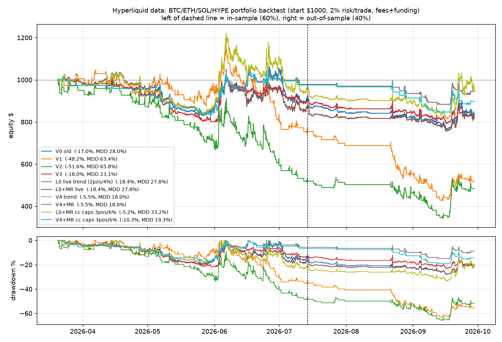

# 回测报告：浮盈回吐问题 —— V0 现行策略 vs 短周期方案（V1/V2）vs 最小改动（V3）

- 数据：Hyperliquid 官方 candleSnapshot 1h/4h/1d（BTC、ETH、SOL、HYPE），资金费用 fundingHistory 实际值（HYPE 缺数据，用 BTC 资金费代理）
- 回测区间（北京时间）：2026-03-20 08:00 → 2026-09-29 10:00，共 4634 根 1h；之前的数据只用来预热日线 EMA50/ADX
- 样本内/样本外：前 60% 为样本内（至 2026-07-14 05:00），后 40% 为样本外。所有参数都是事先定好的（用你给的数值或现行配置），**没有做任何参数寻优**
- 成本：taker 0.045%、maker 0.015%（只有 V1/V2 的分批止盈限价单按 maker 计），止损/市价单另加 0.02% 滑点，按小时计资金费
- 组合规则与实盘一致：初始 $1000，单笔风险 2% 权益，最多同时 2 仓，组合止损风险 ≤4%，10x 逐仓（止损距离 ≤5%）；信号在 1h 收盘判定、下一根 1h 开盘成交，无前视
- 环境过滤：直接调用仓库 `hl_bot.regime`（日线 EMA20/50 + ADX>22.5，1h 区间冲突时观望；BTC 做空要求 ADX>25）

## 1. 组合结果（四个币共用一个账户）

| 版本 | 总收益 | 最大回撤 | 交易数 | 胜率 | 盈亏比 PF | 平均 R | 峰值浮盈回吐率* | 持仓时间占比 | 手续费 | 样本内 收益/PF | 样本外 收益/PF |
|---|---|---|---|---|---|---|---|---|---|---|---|
| V0 现行 | -16.8% | 28.0% | 77 | 14% | 0.48 | -0.11 | 98% (n=30) | 95% | $30 | -8.2% / 0.09 | -9.4% / 1.29 |
| V1 1h+分批 | -37.9% | 56.6% | 232 | 35% | 0.80 | -0.09 | 68% (n=114) | 30% | $296 | -20.0% / 0.85 | -22.5% / 0.69 |
| V2 1h+金字塔 | -48.5% | 65.0% | 209 | 21% | 0.69 | -0.12 | 102% (n=111) | 31% | $276 | -43.2% / 0.63 | -9.4% / 0.86 |
| V3 V0+吊灯保本 | -15.2% | 23.1% | 197 | 30% | 0.74 | -0.03 | 76% (n=38) | 87% | $67 | -6.7% / 0.80 | -9.0% / 0.61 |

\* 峰值浮盈回吐率 = (持仓期间最高浮盈 − 最终盈亏) / 最高浮盈，只统计最高浮盈 ≥0.5R 的交易（R = 开仓时权益的 2%）；>100% 表示由盈转亏。浮盈按 1h 收盘价计。

## 2. 分币种（每个币单独 $1000 独立回测，不受「最多 2 仓 / 币种顺序」影响）

| 版本 | 币种 | 交易数 | 胜率 | 总收益 | 最大回撤 | PF | 平均 R | 浮盈回吐率 | 持仓时间占比 |
|---|---|---|---|---|---|---|---|---|---|
| V0 现行 | BTC | 25 | 12% | +10.1% | 12.8% | 1.81 | +0.23 | 98% (n=10) | 70% |
| V0 现行 | ETH | 33 | 9% | -5.1% | 18.0% | 0.69 | -0.07 | 95% (n=12) | 77% |
| V0 现行 | SOL | 20 | 20% | +7.9% | 18.4% | 2.40 | +0.20 | 93% (n=10) | 39% |
| V0 现行 | HYPE | 32 | 25% | -6.9% | 13.4% | 0.47 | -0.11 | 94% (n=13) | 61% |
| V1 1h+分批 | BTC | 79 | 35% | -18.2% | 32.3% | 0.77 | -0.11 | 62% (n=39) | 11% |
| V1 1h+分批 | ETH | 80 | 34% | -19.9% | 34.4% | 0.73 | -0.13 | 64% (n=34) | 12% |
| V1 1h+分批 | SOL | 50 | 32% | -5.3% | 16.2% | 0.89 | -0.04 | 62% (n=24) | 9% |
| V1 1h+分批 | HYPE | 68 | 35% | -0.5% | 23.8% | 0.99 | +0.01 | 75% (n=36) | 14% |
| V2 1h+金字塔 | BTC | 72 | 14% | -39.1% | 46.9% | 0.48 | -0.32 | 108% (n=34) | 11% |
| V2 1h+金字塔 | ETH | 74 | 23% | -29.5% | 38.1% | 0.61 | -0.22 | 100% (n=32) | 13% |
| V2 1h+金字塔 | SOL | 45 | 24% | +3.7% | 17.7% | 1.08 | +0.08 | 94% (n=24) | 10% |
| V2 1h+金字塔 | HYPE | 64 | 14% | -11.2% | 28.3% | 0.80 | -0.06 | 107% (n=38) | 15% |
| V3 V0+吊灯保本 | BTC | 77 | 26% | +8.8% | 10.0% | 1.35 | +0.07 | 74% (n=14) | 57% |
| V3 V0+吊灯保本 | ETH | 94 | 30% | -9.8% | 14.9% | 0.66 | -0.05 | 78% (n=19) | 67% |
| V3 V0+吊灯保本 | SOL | 51 | 25% | +10.7% | 9.9% | 1.76 | +0.11 | 76% (n=14) | 38% |
| V3 V0+吊灯保本 | HYPE | 79 | 25% | -5.8% | 13.5% | 0.79 | -0.03 | 83% (n=19) | 54% |

补充（不在主表里，只作敏感性参考）：给 V0/V3 加上「止损后同向冷却 2 根 4h」（也就是 A 部分修复里上线的规则），组合结果：V0+冷却 −19.3%（MDD 27.8%，PF 0.42）；V3+冷却 −0.4%（MDD 24.0%，PF 0.99，回吐率 79%）。两者方向相反，说明冷却的效果高度依赖路径，这一个样本不能当作结论。

## 3. 结论

1. **浮盈回吐问题确实存在，而且是现行策略的系统性特征**：V0 里最高浮盈 ≥0.5R 的交易，平均回吐约 **93–98%**（组合 98%，n=30）。原因是 0.5×ATR/1×ATR 的阶梯追踪太慢，4h ATR×2 的止损又离价格很远，大部分浮盈在止损跟上来之前就回去了。你看到的 SOL 从 +$16.9 回到 −$5.1，就是这个典型路径。
2. **照原样切到 1h 短线（V1/V2），回测明显更差**：V1 组合 −37.9%（MDD 56.6%），V2 −48.5%（MDD 65.0%），样本内、样本外都亏。回吐率确实降下来了（V1 68%），但 1h 的 1.5×ATR 止损很窄，按 2% 风险算仓位后名义价值往往是权益的 2–3 倍，手续费加滑点大约吃掉 **$296（权益的 30%）**，1h 级别的假突破/来回扫也多。只有 SOL 独立回测时 V2 小赚（+3.7%），其余币种都亏。
3. **最小改动 V3（V0 的入场不变，改为吊灯止损 + 1R 保本）是四个版本里最稳的**：组合 −15.2% 对 V0 的 −16.8%，最大回撤 23.1% 对 28.0%，回吐率 98% → 76%；独立回测里 BTC +8.8%、SOL +10.7%，ETH/HYPE 仍亏。不过样本外 PF 0.61 低于 V0 的 1.29（V0 样本外靠少数几笔大单），**优势不显著**。
4. 这 6 个多月四个版本的组合结果**全部为负**。现行框架下，趋势段不足以覆盖震荡段的来回止损（V0 胜率只有 14%）。

## 4. 建议

- **不建议**按 V1/V2 现在的参数上实盘。
- 如果要改，优先选 **V3 式的出场改动**：保留日线/4h 入场，把阶梯追踪换成「持仓以来最高价 − 2×ATR(4h)」的吊灯止损，浮盈到 1R 后止损至少移到保本。这个改动小、手续费基本不增加，也能直接对应「浮盈回吐」的问题。上线前建议先用 dry-run 纸盘跑 2–4 周。
- 「先拿基础利润、真正单边时再逐步加仓」这个思路本身可以保留，但要在 **4h 周期**上做（例如 1R 保本 + 2R 减半 + 吊灯追踪 + 保本后按 4h 突破加仓），避免 1h 级别的高频与费用拖累。这需要另做一轮回测（会引入新参数，要注意过拟合）。
- 实盘的风险其实更多来自 **ETH/HYPE**（每个版本都亏）。可以考虑先只在 BTC/SOL 上跑趋势策略，但这个结论同样只来自一个 6 个月样本。

## 5. 注意事项（Caveats）

- 样本只有约 6.3 个月（Hyperliquid 1h K 线最多只提供约 5000 根），4 个币、每个版本几十到两百笔交易，统计意义有限。组合结果对「最多 2 仓 + 币种先后顺序」很敏感：V0 独立回测四个币的合计是正的，组合却是 −16.8%，原因是 BTC/ETH 先占满了两个仓位。
- 模型简化：
  - 入场一律按下一根 1h 开盘价 taker 成交（实盘的突破单是 Maker 限价，可能成交不了，也可能手续费更低）；
  - 止损按 1h K 线盘中触发，成交价取止损价与开盘价中较差的一个，另加 0.02% 滑点；
  - 同一根 K 线里止损和止盈都触及时，按先止损处理（偏保守）；
  - 实盘每 15 分钟扫描一次，回测按 1h 收盘；
  - 没有包含实盘里的均值回归子策略；
  - HYPE 的资金费用 BTC 代理；
  - 没有模拟 429、部分成交、强平。
- V1 的 1h 入场规则（EMA20 回踩后收盘站上前高，或 20 根突破）是按你的描述事先定的一个具体实现，没有调参。换一种入场定义结果可能不同，但手续费拖累是结构性的。
- 回测代码在 `/workspace/hl_backtest/`（bt.py、report.py、fetch.py、data/），还没有提交到仓库。
